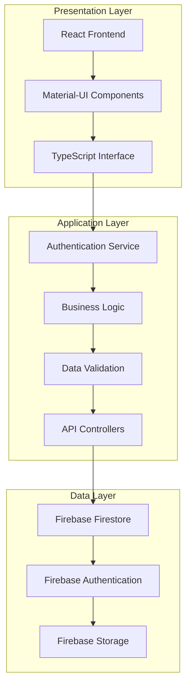
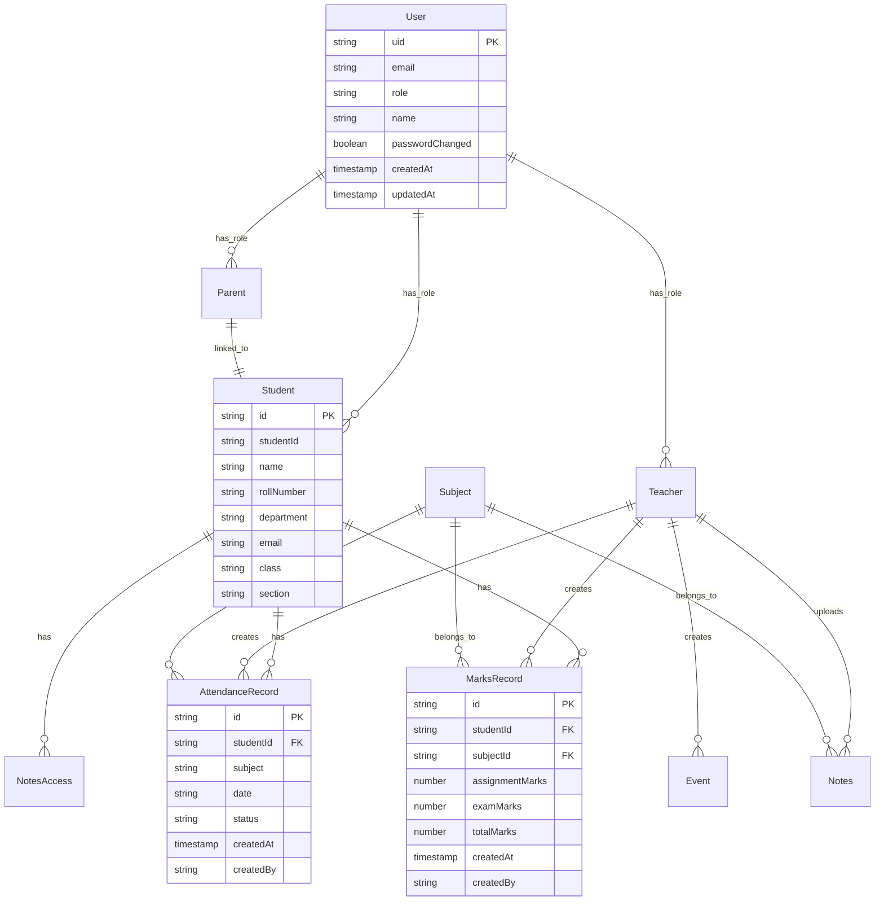
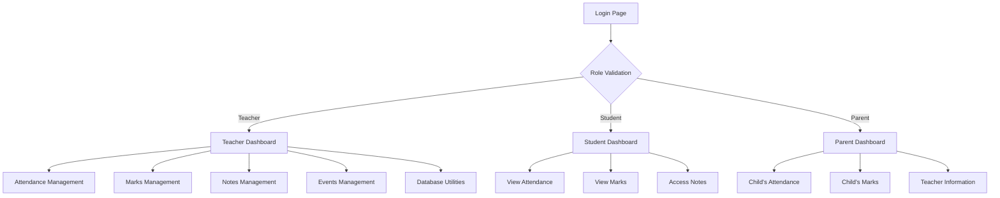

# System Requirements Specification (SRS)
## AcadeVerse - Educational Management System

---

## Abstract

AcadeVerse is a comprehensive web-based educational management system designed to streamline academic operations for educational institutions. The system provides a unified platform for teachers, students, and parents to manage and track academic activities including attendance management, marks recording and viewing, notes distribution, and event coordination. Built using modern web technologies including React.js with TypeScript for the frontend and Firebase for backend services, AcadeVerse offers role-based access control ensuring secure and appropriate access to information based on user roles.

The system addresses the growing need for digital transformation in educational institutions by providing real-time access to academic information, reducing administrative overhead, and improving communication between all stakeholders in the educational ecosystem. With features like automated attendance tracking, comprehensive marks management, secure document sharing, and parent-student linkage, AcadeVerse serves as a complete solution for modern educational administration.

---

## 1. Introduction

### 1.1 Purpose

The purpose of this System Requirements Specification document is to provide a comprehensive description of the AcadeVerse Educational Management System. This document serves as a blueprint for system development, defining functional and non-functional requirements, user interfaces, system architecture, and implementation guidelines. It is intended for use by system developers, project managers, quality assurance teams, and stakeholders involved in the development and deployment of the system.

### 1.2 Scope

AcadeVerse is designed as a complete educational management solution targeting schools and colleges offering computer science programs. The system encompasses:

**Core Functional Areas:**
- User Authentication and Role Management (Teachers, Students, Parents)
- Student Information Management
- Attendance Tracking and Reporting
- Academic Performance Management (Marks and Grades)
- Digital Notes and Study Material Distribution
- Academic Event and Calendar Management
- Parent-Student Account Linking and Monitoring

**Target Users:**
- **Teachers**: Primary system administrators who manage student data, record attendance, input marks, and distribute study materials
- **Students**: End users who view their academic progress, attendance records, and access study materials
- **Parents**: Secondary users who monitor their children's academic performance and attendance

**System Boundaries:**
The system operates as a web-based application accessible through modern web browsers, with data stored and managed through cloud-based Firebase services.

### 1.3 Definitions and Abbreviations

**Technical Terms:**
- **SRS**: System Requirements Specification
- **UI**: User Interface
- **API**: Application Programming Interface
- **CRUD**: Create, Read, Update, Delete operations
- **JWT**: JSON Web Token for authentication
- **SPA**: Single Page Application
- **PWA**: Progressive Web Application

**Domain-Specific Terms:**
- **Roll Number**: Unique identifier assigned to each student
- **Student ID**: System-generated unique identifier (format: CS2023XXXX)
- **Parent ID**: System-generated identifier for parent accounts (format: P-CS2023XXXX)
- **Subject Code**: Unique identifier for academic subjects
- **Attendance Status**: Present/Absent indicator for student attendance
- **Academic Session**: Time period for which academic activities are tracked

### 1.4 System Overview

AcadeVerse follows a client-server architecture with a React-based frontend communicating with Firebase backend services. The system implements role-based access control with three distinct user types, each having specific permissions and interface customizations. The architecture ensures scalability, security, and real-time data synchronization across all user sessions.

---

## 2. System Analysis

### 2.1 Current System Analysis

**Existing Challenges in Educational Management:**
- Manual attendance tracking leading to errors and time consumption
- Paper-based marks recording causing data loss and accessibility issues
- Lack of real-time communication between teachers, students, and parents
- Inefficient distribution of study materials and notices
- Limited tracking of student academic progress over time
- Administrative overhead in managing student records and reports

**Limitations of Traditional Systems:**
- Data redundancy and inconsistency across different departments
- Limited accessibility of academic records outside institution premises
- Time-intensive report generation processes
- Lack of automated backup and recovery mechanisms
- Inadequate security measures for sensitive academic data

### 2.2 Proposed System Analysis

**System Advantages:**
- **Real-time Data Access**: Instant availability of attendance and academic records
- **Automated Calculations**: Automatic computation of attendance percentages and grade calculations
- **Enhanced Security**: Role-based access control with Firebase authentication
- **Scalability**: Cloud-based infrastructure supporting institutional growth
- **Cost Efficiency**: Reduced paper usage and administrative overhead
- **Improved Communication**: Direct channel between all educational stakeholders

**System Capabilities:**
- Multi-role user management with appropriate access controls
- Comprehensive attendance tracking with date-wise filtering
- Detailed marks management across multiple subjects
- Secure document storage and sharing capabilities
- Parent monitoring features with student progress tracking
- Administrative tools for database management and maintenance

### 2.3 Feasibility Study

**Technical Feasibility:**
- Utilization of proven technologies (React.js, TypeScript, Firebase)
- Cloud-based infrastructure ensuring scalability and reliability  
- Modern browser compatibility across different devices
- Integration capabilities with existing educational systems

**Economic Feasibility:**
- Cost-effective cloud-based deployment model
- Reduced operational costs through automation
- Minimal hardware requirements for client access
- Lower maintenance costs compared to traditional systems

**Operational Feasibility:**
- Intuitive user interfaces requiring minimal training
- Gradual migration path from existing systems
- Comprehensive user documentation and support materials
- Flexible configuration options for institutional requirements

### 2.4 Risk Analysis

**Technical Risks:**
- Internet connectivity dependency for system access
- Firebase service availability and performance variations
- Browser compatibility issues with older versions
- Data migration challenges from legacy systems

**Security Risks:**
- Unauthorized access to sensitive academic data
- Data breaches affecting student privacy
- Authentication system vulnerabilities
- Inadequate backup and recovery procedures

**Mitigation Strategies:**
- Implementation of robust authentication mechanisms
- Regular security audits and vulnerability assessments
- Comprehensive backup and disaster recovery procedures
- User training programs on security best practices

---

## 3. System Design

### 3.1 System Architecture

AcadeVerse implements a modern three-tier architecture comprising presentation, application, and data layers:



**Architecture Components:**

**Frontend Layer:**
- React.js with TypeScript for type-safe development
- Material-UI component library for consistent user experience
- React Router for client-side navigation management
- Context API for global state management

**Backend Services:**
- Firebase Authentication for secure user management
- Firestore database for real-time data storage
- Firebase Storage for document and file management
- Cloud Functions for server-side business logic

### 3.2 Database Design

**Entity Relationship Model:**



**Database Collections:**

**Users Collection:**
- Primary authentication and role management
- Links to specific role-based profiles
- Password management and security settings

**Students Collection:**
- Comprehensive student information
- Academic enrollment details
- Parent linkage information

**Attendance Collection:**
- Daily attendance records with timestamps
- Subject-wise attendance tracking
- Teacher attribution for record creation

**Marks Collection:**
- Subject-wise academic performance data
- Assignment and examination marks separation
- Historical performance tracking

### 3.3 User Interface Design

**Design Principles:**
- **Responsive Design**: Optimal viewing across devices and screen sizes
- **Role-Based Interfaces**: Customized layouts based on user roles
- **Intuitive Navigation**: Clear menu structures and breadcrumb navigation
- **Accessibility Compliance**: Support for users with disabilities
- **Performance Optimization**: Fast loading times and smooth interactions

**Interface Hierarchy:**



### 3.4 Security Design

**Authentication Framework:**
- Firebase Authentication with email/password mechanism
- Role-based access control implementation
- Session management with automatic timeout
- Password complexity requirements and reset functionality

**Data Protection Measures:**
- Firestore security rules preventing unauthorized access
- Input validation and sanitization on client and server sides
- Encrypted data transmission using HTTPS protocol
- Regular security audits and vulnerability assessments

**Privacy Controls:**
- Student data access limited to authorized personnel
- Parent access restricted to linked student information only
- Audit logging for sensitive operations
- Compliance with educational data privacy regulations

---

## 4. Coding and Implementation

### 4.1 Technology Stack Selection

**Frontend Technologies:**
- **React.js 19.1.1**: Core framework for user interface development
- **TypeScript 5.8.3**: Type-safe JavaScript development
- **Material-UI 5.15.10**: Comprehensive component library
- **React Router DOM 7.8.0**: Client-side routing management
- **React Hook Form 7.62.0**: Form handling and validation
- **Date-fns 4.1.0**: Date manipulation and formatting utilities

**Backend Services:**
- **Firebase 12.2.1**: Complete backend-as-a-service platform
- **Firestore**: NoSQL document database for real-time data
- **Firebase Authentication**: User authentication and authorization
- **Firebase Storage**: File storage and management service

**Development Tools:**
- **Vite 7.1.0**: Modern build tool and development server
- **ESLint 9.32.0**: Code quality and style enforcement
- **TypeScript ESLint**: TypeScript-specific linting rules

### 4.2 Application Architecture Implementation

**Component Architecture:**
The application follows a hierarchical component structure with clear separation of concerns:

**Page Components:**
- LoginPage: Authentication interface with role selection
- TeacherDashboard: Teacher-specific landing page and navigation
- StudentDashboard: Student-focused interface with academic information
- ParentDashboard: Parent view with child monitoring capabilities

**Feature Components:**
- AttendanceManagement: Teacher interface for recording attendance
- MarksManagement: Academic performance recording and management
- NotesManagement: Study material upload and distribution system
- EventsManagement: Academic calendar and event coordination

**Shared Components:**
- AuthContext: Global authentication state management
- ProtectedRoute: Route-level access control implementation
- Database utilities: Common database operation functions

### 4.3 State Management Implementation

**Global State Architecture:**
React Context API provides centralized state management for:
- User authentication status and profile information
- Application-wide configuration settings
- Shared data across multiple components
- Error handling and notification systems

**Local State Management:**
Component-level state handling for:
- Form data and validation states
- UI interaction states (loading, modals, dialogs)
- Temporary data storage during user operations
- Component-specific configuration options

### 4.4 Database Integration

**Firestore Integration Patterns:**
Real-time data synchronization through:
- Collection-based data organization
- Document-level security rules
- Real-time listeners for live data updates
- Batch operations for data consistency

**Data Access Layer:**
Centralized database utilities providing:
- CRUD operations for all data entities
- Query optimization and caching
- Error handling and retry mechanisms
- Data validation and transformation

### 4.5 Authentication Implementation

**Firebase Authentication Flow:**
Multi-step authentication process:
1. Email format validation based on user role
2. Firebase Authentication credential verification
3. Firestore user profile retrieval and validation
4. Role-based access control enforcement
5. Session establishment and maintenance

**Security Implementation:**
- Password complexity requirements
- Account lockout mechanisms
- Session timeout handling
- Secure password reset procedures

### 4.6 Error Handling and Logging

**Error Management Strategy:**
Comprehensive error handling across:
- Network connectivity issues
- Database operation failures
- Authentication and authorization errors
- Client-side validation failures
- Server-side processing errors

**Logging Implementation:**
Structured logging for:
- User authentication events
- Database operation tracking
- Error occurrence and resolution
- Performance monitoring metrics

---

## 5. System Testing

### 5.1 Testing Strategy Overview

The testing approach for AcadeVerse encompasses multiple testing levels to ensure system reliability, security, and performance. The strategy follows industry best practices with emphasis on user experience validation and data integrity verification.

**Testing Methodology:**
- **Test-Driven Development**: Unit tests written before implementation
- **Behavior-Driven Development**: User story validation through acceptance tests
- **Risk-Based Testing**: Priority testing based on system risk assessment
- **Continuous Testing**: Automated testing integration in development pipeline

### 5.2 Unit Testing

**Component Testing Framework:**
Individual component validation focusing on:
- React component rendering verification
- State management functionality testing
- Props handling and type validation
- Event handling and user interaction testing
- Component lifecycle method validation

**Database Function Testing:**
- CRUD operation validation for all data entities
- Query performance and accuracy verification
- Data validation rule testing
- Error handling mechanism validation
- Connection pooling and resource management

**Authentication Module Testing:**
- Login functionality across different user roles
- Password validation and security requirements
- Session management and timeout handling
- Role-based access control verification
- Security token generation and validation

### 5.3 Integration Testing

**Frontend-Backend Integration:**
- API endpoint connectivity and response validation
- Real-time data synchronization testing
- Authentication flow integration verification
- File upload and download functionality testing
- Cross-browser compatibility validation

**Database Integration Testing:**
- Firebase service integration verification
- Data consistency across multiple operations
- Transaction handling and rollback procedures
- Concurrent user access and data integrity
- Backup and restore functionality validation

**Third-Party Service Integration:**
- Firebase Authentication service integration
- Firebase Storage service functionality
- Email notification service integration
- Date and time handling library validation

### 5.4 System Testing

**Functional Testing Scenarios:**

**Teacher Role Testing:**
- Student attendance recording and modification
- Marks entry and calculation validation
- Notes upload and sharing functionality
- Event creation and management
- Database maintenance utility testing

**Student Role Testing:**
- Attendance record viewing and filtering
- Academic performance tracking
- Study material access and download
- Personal profile information viewing
- Dashboard navigation and functionality

**Parent Role Testing:**
- Child attendance monitoring
- Academic performance tracking
- Teacher information access
- Account linking verification
- Notification and alert systems

### 5.5 Performance Testing

**Load Testing Scenarios:**
- Concurrent user access simulation (100+ simultaneous users)
- Database query performance under heavy load
- File upload and download stress testing
- Real-time data synchronization performance
- System resource utilization monitoring

**Scalability Testing:**
- Database growth impact on system performance
- Increased user base handling capabilities
- Network bandwidth utilization optimization
- Server response time under various load conditions
- Memory usage optimization validation

### 5.6 Security Testing

**Authentication Security:**
- Unauthorized access prevention testing
- Password strength enforcement validation
- Session hijacking prevention measures
- Cross-site scripting (XSS) vulnerability testing
- SQL injection protection verification

**Data Security Testing:**
- Sensitive data encryption validation
- Role-based data access restriction testing
- Data transmission security verification
- Database security rule validation
- Audit trail functionality testing

### 5.7 User Acceptance Testing

**User Experience Validation:**
- Interface usability testing with target users
- Navigation flow optimization
- Accessibility compliance verification
- Mobile responsiveness testing
- User training and documentation validation

**Business Process Testing:**
- End-to-end workflow validation
- Data accuracy and integrity verification
- Reporting functionality testing
- System integration with existing processes
- Stakeholder requirement satisfaction

### 5.8 Testing Tools and Environment

**Testing Tools:**
- **Jest**: JavaScript testing framework for unit tests
- **React Testing Library**: Component testing utilities
- **Cypress**: End-to-end testing framework
- **Firebase Emulator Suite**: Local testing environment
- **Lighthouse**: Performance and accessibility testing

**Testing Environment Setup:**
- Development environment with mock data
- Staging environment with production-like data
- User acceptance testing environment
- Performance testing environment with load simulation
- Security testing environment with vulnerability scanning

---

## 6. Future Scope

### 6.1 Introduction

AcadeVerse represents a foundational educational management system with significant potential for expansion and enhancement. The current implementation provides core functionality for attendance management, academic performance tracking, and user role management. However, the system architecture and technology stack chosen provide a solid foundation for future developments that can transform AcadeVerse into a comprehensive educational ecosystem.

The future scope encompasses technological advancements, feature enhancements, integration capabilities, and scalability improvements that will position AcadeVerse as a leading solution in the educational technology sector. These enhancements are designed to address evolving educational needs, leverage emerging technologies, and provide greater value to educational institutions and their stakeholders.

### 6.2 Planned Enhancements

**Advanced Analytics and Reporting:**
- **Predictive Analytics**: Implementation of machine learning algorithms to predict student performance trends and identify at-risk students early
- **Advanced Reporting Dashboard**: Comprehensive analytics with customizable reports, data visualization charts, and performance trend analysis
- **Comparative Analysis**: Benchmarking capabilities for comparing individual student performance against class averages and historical data
- **Automated Report Generation**: Scheduled generation and distribution of periodic reports to stakeholders

**Mobile Application Development:**
- **Native Mobile Apps**: Development of iOS and Android applications for enhanced mobile user experience
- **Offline Functionality**: Capability to work offline with data synchronization when connectivity is restored
- **Push Notifications**: Real-time alerts for important updates, deadlines, and announcements
- **Biometric Attendance**: Integration with mobile device biometric systems for secure attendance marking

**Artificial Intelligence Integration:**
- **Intelligent Tutoring System**: AI-powered personalized learning recommendations based on student performance patterns
- **Automated Grading**: Machine learning-based assessment tools for objective question evaluation
- **Chatbot Support**: AI-powered virtual assistant for answering common queries and providing system support
- **Natural Language Processing**: Analysis of student feedback and comments for sentiment analysis and improvement suggestions

**Enhanced Communication Features:**
- **Real-time Messaging**: Direct communication channels between teachers, students, and parents
- **Video Conferencing Integration**: Built-in video calling capabilities for virtual classes and parent-teacher meetings
- **Announcement System**: Multi-channel notification system with email, SMS, and in-app notifications
- **Discussion Forums**: Subject-wise discussion boards for collaborative learning

**Advanced Security and Compliance:**
- **Multi-Factor Authentication**: Enhanced security with biometric verification and two-factor authentication options
- **GDPR Compliance**: Implementation of data protection regulations compliance features
- **Advanced Audit Logging**: Comprehensive tracking of all system activities and user actions
- **Data Encryption**: Advanced encryption for data at rest and in transit

**Learning Management System Features:**
- **Assignment Management**: Online assignment submission and automated plagiarism detection
- **Quiz and Examination System**: Online testing platform with anti-cheating mechanisms
- **Grade Book Integration**: Comprehensive grade tracking with weighted scoring systems
- **Learning Path Tracking**: Personalized learning journey mapping for individual students

**Integration Capabilities:**
- **LMS Integration**: Compatibility with popular Learning Management Systems like Moodle and Canvas
- **ERP System Integration**: Connection with institutional Enterprise Resource Planning systems
- **Payment Gateway Integration**: Online fee payment and financial transaction management
- **Third-party Tool Integration**: API connections with educational tools and services

### 6.3 Summary

The future scope of AcadeVerse demonstrates the system's potential for evolution into a comprehensive educational technology platform. The planned enhancements focus on leveraging cutting-edge technologies such as artificial intelligence, machine learning, and advanced analytics to provide deeper insights into educational processes and student performance.

The integration of mobile applications and offline capabilities will ensure accessibility across diverse technological environments, while enhanced communication features will strengthen the connection between all educational stakeholders. Security and compliance improvements will address growing concerns about data privacy and protection in educational settings.

These enhancements will position AcadeVerse as a forward-thinking solution that not only meets current educational management needs but also anticipates and addresses future challenges in the education sector. The modular architecture and cloud-based infrastructure provide the flexibility needed to implement these improvements incrementally while maintaining system stability and performance.

---

## 7. Conclusion

### 7.1 Project Summary

AcadeVerse represents a significant advancement in educational management technology, providing a comprehensive digital solution that addresses the core needs of modern educational institutions. The system successfully integrates attendance management, academic performance tracking, and stakeholder communication into a unified platform that serves teachers, students, and parents effectively.

The implementation of modern web technologies including React.js with TypeScript and Firebase backend services ensures scalability, reliability, and security. The role-based access control system maintains appropriate data privacy while enabling efficient information sharing among authorized users. The intuitive user interface design minimizes the learning curve for system adoption while maximizing functional capabilities.

Key achievements of the AcadeVerse system include:
- **Streamlined Operations**: Significant reduction in administrative overhead through automation
- **Real-time Access**: Instant availability of academic information for all stakeholders
- **Enhanced Security**: Robust authentication and authorization mechanisms
- **Improved Communication**: Direct channels for information sharing between educational participants
- **Scalable Architecture**: Cloud-based infrastructure supporting institutional growth

### 7.2 Impact and Benefits

The implementation of AcadeVerse delivers substantial benefits across multiple dimensions of educational management:

**Administrative Efficiency:**
- Reduction in manual data entry and processing time
- Automated calculation and reporting capabilities
- Centralized data management reducing redundancy
- Streamlined communication workflows

**Educational Quality Enhancement:**
- Real-time monitoring of student academic progress
- Early identification of performance issues
- Improved parent engagement in student education
- Enhanced teacher productivity through automation

**Stakeholder Satisfaction:**
- Students gain immediate access to their academic information
- Parents receive timely updates on their children's progress
- Teachers focus more on education with reduced administrative burden
- Institutional administrators benefit from comprehensive reporting capabilities

The system demonstrates the potential for technology to transform traditional educational management practices, creating more efficient, transparent, and effective learning environments. As educational institutions continue to embrace digital transformation, AcadeVerse provides a solid foundation for future technological integration and enhancement.

The successful implementation of this system establishes a framework for continued innovation in educational technology, paving the way for advanced features and capabilities that will further enhance the educational experience for all stakeholders.

---

## 8. Appendix

### 8.1 Source Code Architecture

**Project Structure Overview:**

```
AcadeVerse/
├── react-app/
│   ├── src/
│   │   ├── components/
│   │   │   ├── TeacherDashboard/
│   │   │   │   ├── AttendanceManagement.tsx
│   │   │   │   ├── MarksManagement.tsx
│   │   │   │   ├── NotesManagement.tsx
│   │   │   │   └── EventsManagement.tsx
│   │   │   ├── StudentDashboard/
│   │   │   │   ├── StudentAttendance.tsx
│   │   │   │   ├── StudentMarks.tsx
│   │   │   │   └── StudentNotes.tsx
│   │   │   └── ParentDashboard/
│   │   │       ├── ParentAttendance.tsx
│   │   │       ├── ParentMarks.tsx
│   │   │       └── ParentTeachers.tsx
│   │   ├── context/
│   │   │   └── AuthContext.tsx
│   │   ├── pages/
│   │   │   ├── LoginPage.tsx
│   │   │   ├── TeacherDashboard.tsx
│   │   │   ├── StudentDashboard.tsx
│   │   │   └── ParentDashboard.tsx
│   │   ├── services/
│   │   │   ├── firebase.ts
│   │   │   ├── dbUtils.ts
│   │   │   └── initDb.ts
│   │   ├── App.tsx
│   │   └── types.d.ts
│   └── package.json
└── firebase.json
```

**Core Authentication Context Implementation:**

The authentication system implements a comprehensive context provider pattern that manages user sessions, role-based access, and secure authentication flows. The context includes methods for user login with role validation, password management, and session handling.

**Database Utility Functions:**

Centralized database utilities provide standardized interfaces for all data operations including student management, attendance tracking, marks recording, and notes handling. These utilities implement error handling, data validation, and query optimization.

**Component Architecture Pattern:**

The application follows a hierarchical component structure with clear separation between presentational and container components. Each major feature area has dedicated components that handle specific business logic while maintaining reusability and maintainability.

**Firebase Integration Layer:**

The Firebase integration layer provides seamless connectivity to backend services including authentication, Firestore database, and storage services. This layer abstracts the complexity of Firebase operations and provides a consistent interface for frontend components.

**Type Definition System:**

Comprehensive TypeScript type definitions ensure type safety across the application, defining interfaces for users, students, attendance records, marks, and all other data entities used throughout the system.

### 8.2 Screen Shots

**Login Interface:**

*Login Page Features:*
- Role-based authentication selection (Teacher/Student/Parent)
- Email format validation based on selected role
- Secure password input with visibility toggle
- Responsive design supporting multiple device types
- Error handling with user-friendly messages
- Password reset functionality access

**Teacher Dashboard:**

*Main Dashboard Features:*
- Navigation sidebar with role-appropriate menu options
- Overview cards displaying key metrics and quick actions
- User profile management with logout functionality
- Breadcrumb navigation for easy orientation
- Responsive layout adapting to different screen sizes

*Attendance Management Interface:*
- Student list with comprehensive information display
- Date picker for attendance record selection
- Subject selection dropdown with predefined options
- Bulk attendance marking with individual override capability
- Real-time status indicators (Present/Absent)
- Save functionality with confirmation feedback

*Marks Management System:**
- Student performance entry forms with validation
- Subject-wise marks categorization (Assignment/Exam)
- Automatic calculation of total scores and percentages
- Historical performance data visualization
- Export functionality for report generation

**Student Dashboard:**

*Personal Dashboard:*
- Personalized welcome message with student information
- Quick access cards for primary functions
- Academic summary with current performance indicators
- Recent activity feed showing latest updates

*Attendance Viewing Interface:*
- Calendar view of attendance records
- Subject-wise attendance percentage display
- Date range filtering capabilities
- Attendance trend visualization
- Detailed daily attendance breakdown

*Academic Performance Display:*
- Subject-wise marks presentation in tabular format
- Performance trend charts and graphs
- Comparison with class averages
- Historical performance tracking
- Downloadable performance reports

**Parent Dashboard:**

*Child Monitoring Interface:*
- Linked student information display
- Real-time access to child's attendance records
- Academic performance monitoring with detailed breakdown
- Communication interface with teachers
- Progress tracking over academic sessions

*Attendance Monitoring:*
- Child's attendance status with detailed daily records
- Monthly and semester attendance summaries
- Alert notifications for attendance irregularities
- Historical attendance pattern analysis

*Academic Performance Tracking:*
- Comprehensive view of child's academic achievements
- Subject-wise performance analysis
- Comparison with previous academic periods
- Parent-teacher communication regarding performance

**Mobile Responsive Design:**

All interface screens are optimized for mobile devices with:
- Touch-friendly navigation elements
- Optimized layouts for smaller screens
- Gesture-based interactions where appropriate
- Fast loading times on mobile networks
- Accessibility features for diverse user needs

**System Administration Interfaces:**

*Database Management Utility:*
- Administrative tools for data maintenance
- Bulk import/export functionality
- System health monitoring dashboards
- User account management interfaces
- Backup and restore operation controls
